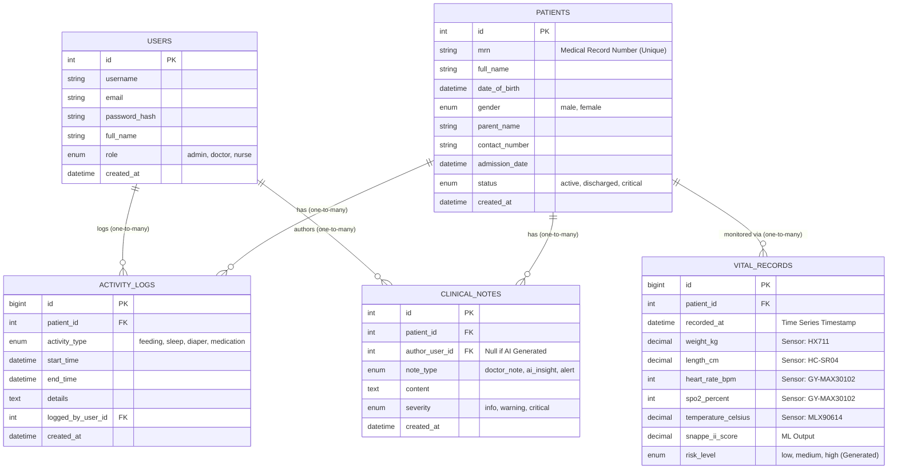

# EPOSREM Database Schema - Entity Relationship Diagram (ERD)

Berikut adalah visualisasi struktur database untuk sistem EPOSREM. Diagram ini ditulis menggunakan format **Mermaid**, yang kompatibel dengan banyak viewer Markdown (seperti GitHub, GitLab, Notion, Obsidian) dan editor kode (VS Code dengan ekstensi Mermaid).

## Keterangan Entitas

1.  **USERS**: Menyimpan data tenaga medis (Dokter/Perawat) yang memiliki akses login.
2.  **PATIENTS**: Data demografis bayi yang sedang dirawat. Kolom `mrn` adalah unique identifier medis.
3.  **VITAL_RECORDS**: Tabel *High-frequency* untuk menyimpan data sensor IoT. Setiap baris mewakili satu "snapshot" pembacaan sensor pada waktu tertentu.
4.  **ACTIVITY_LOGS**: Mencatat interaksi manual seperti pemberian susu, waktu tidur, atau penggantian popok.
5.  **CLINICAL_NOTES**: Menyimpan catatan kualitatif dari dokter maupun *insight* otomatis yang dihasilkan oleh AI/RAG agent.
